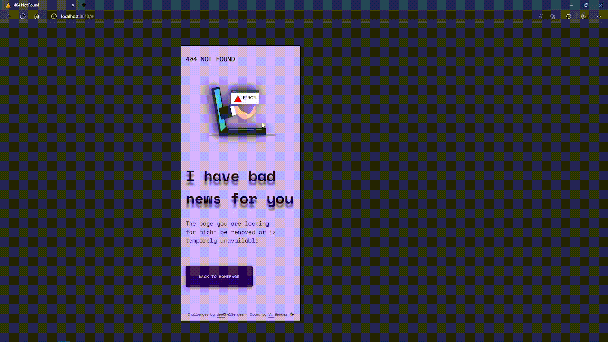

<!-- Please update value in the {}  -->

<h1 align="center">404 Not Found</h1>

   Solution for a challenge from  <a href="http://devchallenges.io" target="_blank">Devchallenges.io</a>.

  <h3>
    <a href="https://{your-demo-link.your-domain}">
      Demo
    </a>
     | 
    <a href="https://github.com/irismendez/404-page-error">
      Solution
    </a>
     | 
    <a href="https://devchallenges.io/challenges/wBunSb7FPrIepJZAg0sY">
      Challenge
    </a>
  </h3>

<!-- TABLE OF CONTENTS -->

## Table of Contents

- [Built With](#built-with)
- [Screenshots](#screenshots)
- [Link](#link)
- [Contact](#contact)

## Built With

- Mobile first
- HTML & CSS
- Grid

## Screenshots

- Mobile

- Desktop

## Link

 👀

## Contact

- DevChallenges [@irismendez](https://devchallenges.io/portfolio/irismendez)
- Frontend Mentor [@irismendez](https://www.frontendmentor.io/profile/irismendez)
- GitHub [@irismendez](https://github.com/irismendez)
- Twitter [@irismendez_](https://twitter.com/irismendez_)